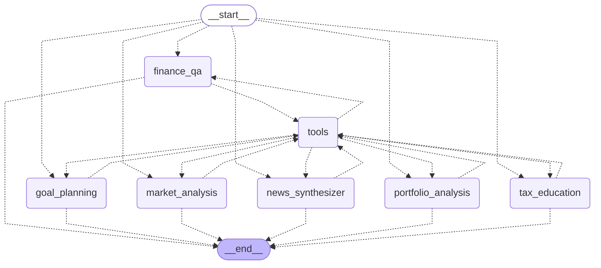

```mermaid
---
config:
  flowchart:
    curve: linear
---
graph TD;
	__start__([<p>__start__</p>]):::first
	finance_qa(finance_qa)
	portfolio_analysis(portfolio_analysis)
	market_analysis(market_analysis)
	goal_planning(goal_planning)
	news_synthesizer(news_synthesizer)
	tax_education(tax_education)
	tools(tools)
	__end__([<p>__end__</p>]):::last
	__start__ -.-> finance_qa;
	__start__ -.-> goal_planning;
	__start__ -.-> market_analysis;
	__start__ -.-> news_synthesizer;
	__start__ -.-> portfolio_analysis;
	__start__ -.-> tax_education;
	finance_qa -.-> __end__;
	finance_qa -.-> tools;
	goal_planning -.-> __end__;
	goal_planning -.-> tools;
	market_analysis -.-> __end__;
	market_analysis -.-> tools;
	news_synthesizer -.-> __end__;
	news_synthesizer -.-> tools;
	portfolio_analysis -.-> __end__;
	portfolio_analysis -.-> tools;
	tax_education -.-> __end__;
	tax_education -.-> tools;
	tools -.-> finance_qa;
	tools -.-> goal_planning;
	tools -.-> market_analysis;
	tools -.-> news_synthesizer;
	tools -.-> portfolio_analysis;
	tools -.-> tax_education;
	classDef default fill:#f2f0ff,line-height:1.2
	classDef first fill-opacity:0
	classDef last fill:#bfb6fc

```
